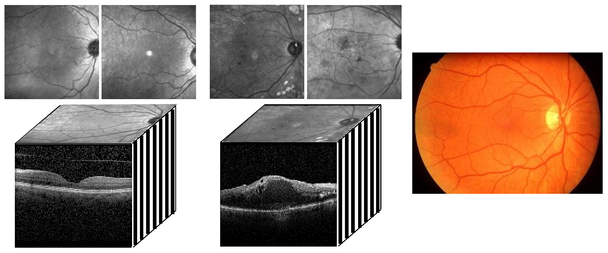

Age-related macular degeneration (AMD) and diabetic retinopathy (DR) are leading causes of blindness worldwide, affecting millions. Early detection and treatment are crucial for these retinal diseases, and retinal optical coherence tomography (OCT) imaging is a key diagnostic tool. Automated image analysis using OCT images has the potential to improve diagnosis and treatment monitoring. However, challenges like noise, distortions, and intensity variations make accurate information extraction difficult. While successful algorithms exist, their robust use in clinical practice remains an ongoing research focus. Here, we present a new method for DR detection on OCT volumes using a common dataset and achieving high performance in retinal image analysis [competition](https://rocc.grand-challenge.org/).
# Instructions for Data Preparation and Classification
1. **Train Data Preparation**:
   - Run the `Main_ROCC_Per_B_Scan.m` script.
   - This script produces the `FeatureVector_HOG.mat` file.

2. **Validation Data Preparation**:
   - Run the `Main_ROCC_Per_B_Scan_Valid.m` script.
   - This script produces the `FeatureVector_Valid_HOG.mat` file.

3. **Test Data Preparation**:
   - Run the `Main_ROCC_Per_B_Scan_Test.m` script.
   - This script produces the `FeatureVector_Test_HOG.mat` file.

4. **Classification**:
   - Run one of the following scripts depending on your training and testing needs:
     - `Main_ROCC_Per_B_Scan_Classification.m` 
     - `Main_ROCC_Per_B_Scan_Classification_Valid.m`
     - `Main_ROCC_Per_B_Scan_Classification_Test.m` 
